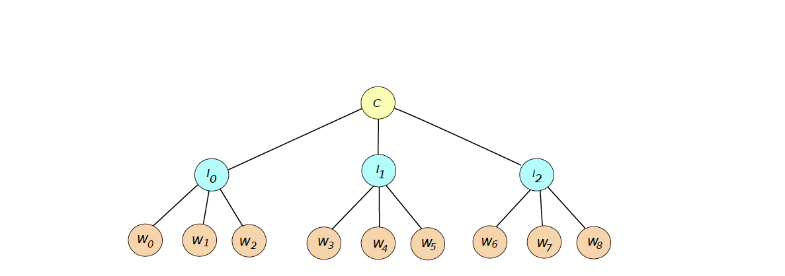

# Pseudoparallel-prime-computing
Compute prime numbers in space between [n,m], where n,m positive integers and n < m.

### Main functionality
This set of programs implement a tree of processes with standard height, which is equal to 2, that uses 3 different algorithms to compute prime numbers within the given space. The idea is to use one core(one CPU) to demonstrate pseudoparallel computing with the aid of concurrent computation.

### Content of current folder
The folder is separated to 3 main folders.
- bin, which contains the binary outpout of source files
- include, which contains the customed libraries with function-prototypes
- src, which contains the source code of whole project

The code compiles and runs with the aid of makefile. Furthermore, for detailed execution profiling and valgrind(both simple and complex) is supported with respective commands. The "clean" command deletes binary files, executables and gmon.out files.

### Program hieararchy
The master process is created by the root.c file, which is the coordinator of the computing. Afterwards, w intemediate processes are created via fork and exec, which are resposible of collecting numbers found by the proccesses of the third stage. The interpocess communication is being achieved via named pipes, that are unlinked after the completetion of the program. It is important to mention, that in the intermediate stage, numbers found are sorted and then are sent in packages to master. A graphic example would be like this: 

### Searching for prime numbers
Each of the leafs of the tree implements a different algorithm per 3 processes. It is worth to mention, that a simplified Miller-Rabin implementation is being used. With more detail, a correction should be made, given the size of n number
- if n < 2,047, it is enough to test a = 2;
- if n < 1,373,653, it is enough to test a = 2 and 3;
- if n < 9,080,191, it is enough to test a = 31 and 73;
- if n < 25,326,001, it is enough to test a = 2, 3, and 5;
It is important to avoid counting as primes the strong pseudoprimes numbers.

>The code was written in Sublime Text 3, so it is higly recommended to use it again for code review in order to maintain the white characters spacing.